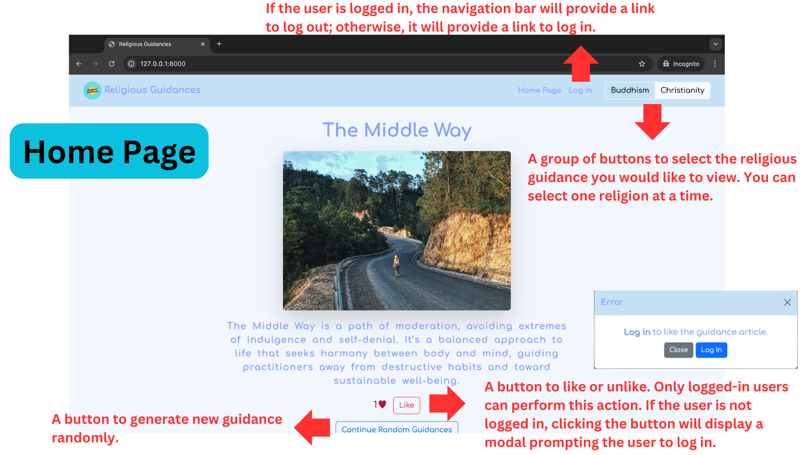
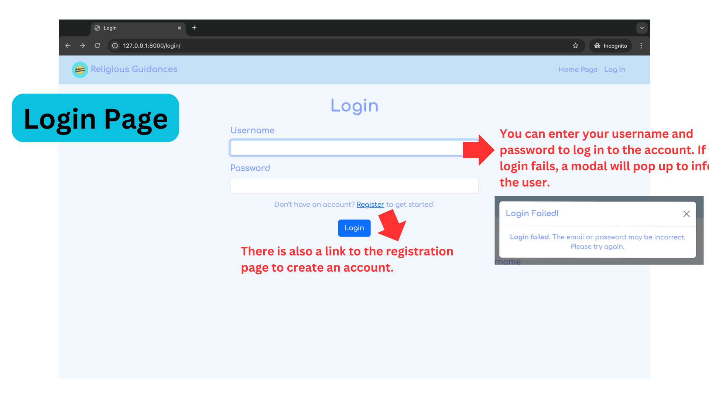
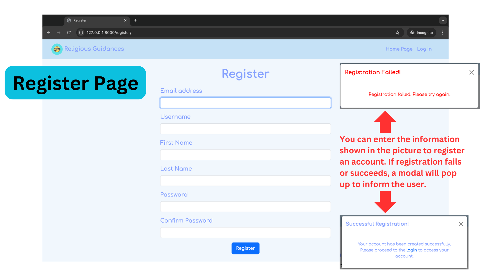
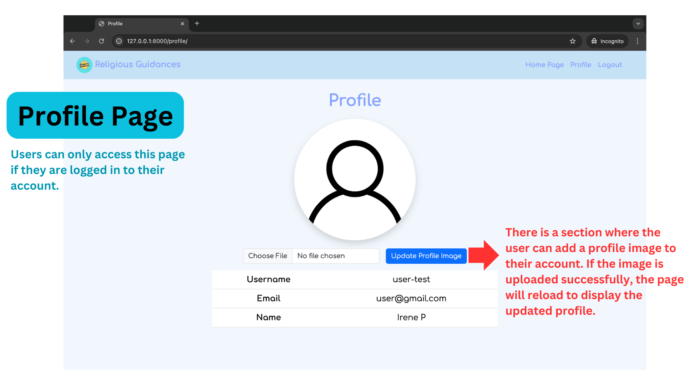
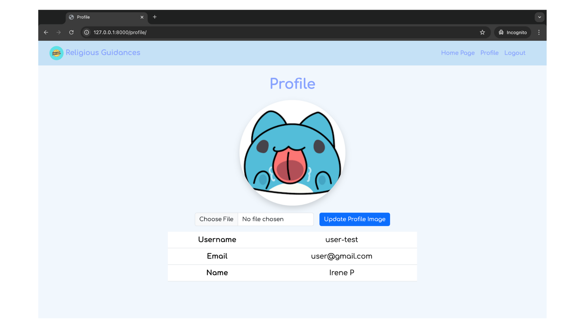

# Religious Guidances
#### Video Demo:  [CS50x: Religious Guidances](https://youtu.be/lu1TV9Fm-90)
#### Description: 

For my final project, I created a website called `Religious Guidance` where users can get random religious teachings. Growing up in Thailand, where Buddhism has a strong influence, inspired me. I found that religious teachings helped me understand life, feel less suffering, and find more happiness.

On this site, users can choose teachings from either **Buddhism** or **Christianity** and can click a _Continue Random Guidances_ button to get a new random guidance. If the user like the guidance, user can click the _Like_ button in order to like that guidance.

## Table of Contents
- [Pages](#pages)
- [Useful Command](#useful-command)

## Pages
### 1. Home Page


#### Navigation Bar:
- For `logged-in users`, the navbar displays a **Log Out** link and a **Profile link** to access the user’s profile page.
- For `logged-out users`, the navbar displays a **Log In** link, and **no profile link** appears.


#### Features:
- Displays randomly selected guidances based on the chosen religion: `Buddhism` or `Christianity`.
- `Like/Unlike button`: If a user is logged in, they can like a guidance. If a user is not logged in, a modal will prompt them to log in.
- `Continue Random Guidance button`: A button to randomly select a new guidance.

### 2. Login Page


#### Features:
- Users can **log in** to their account by providing their `username` and `password`. 
    - If successful, it will be redirected to the homepage. 
    - If unsuccessful, a modal will pop up to inform them that the login attempt has failed.
- There is also a link to the **registration page** to create a new account.

### 3. Register Page


#### Features:

- Users can register for an account by providing a `username`, `email`, `first name`, `last name`, `password`, and `password confirmation`.
    - If registration is successful, a modal will pop up to confirm successful registration and provide a link to the `login page`.
	- If registration fails, a modal will pop up to inform the user of the failure.

### 4. Profile Page


#### Features:
- There is a form to upload a profile image for the user account. If the profile image is successfully uploaded, the profile page will refresh to display the updated image, allowing users to see their changes immediately.


*This is an example of the Profile Page after successfully uploading an image*



## Useful Command
### Command for generating demo guidances

```
cd religious_guidance/
python manage.py add_guidances demo_data/guidances.csv
```
